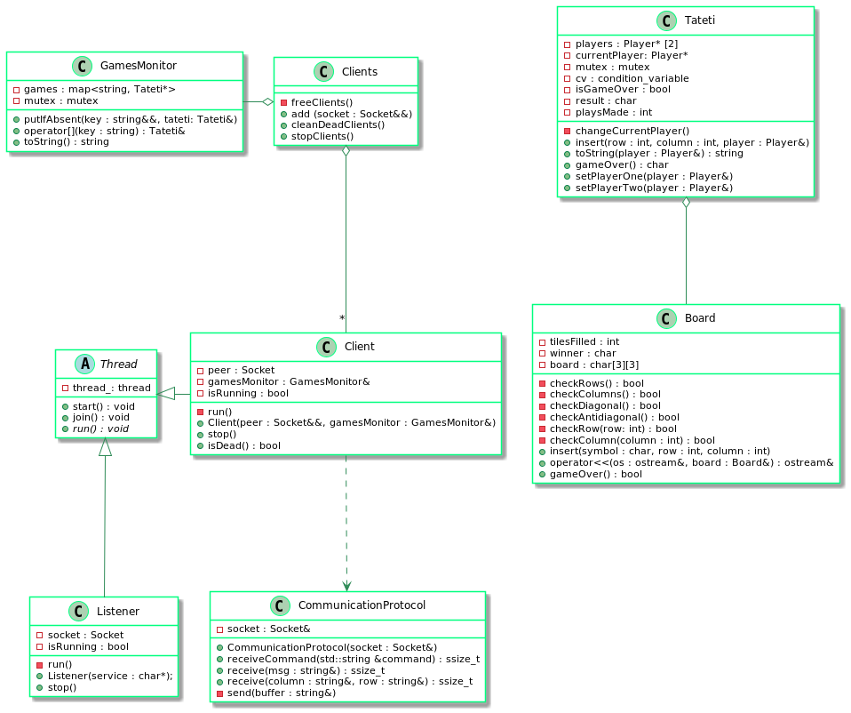
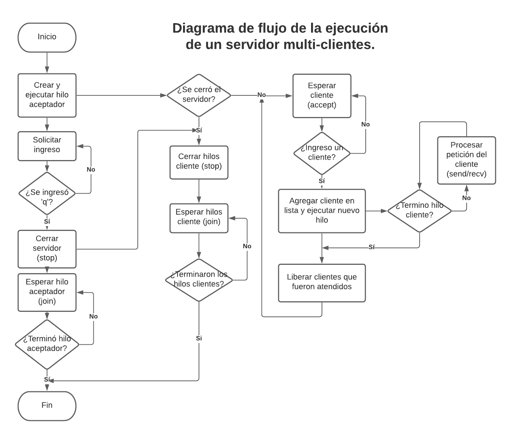

# TP3: Ta-Te-Ti #  
**Autor: Daniel Alejandro Lovera López**  
**Número padrón: 103442**  
**[https://github.com/DanieLovera/tp3](https://github.com/DanieLovera/tp3)**  

---
### Introducción ###  
El presente trabajo consiste en la creación del clásico juego Ta-Te-Ti, de manera distribuida. Es decir, el programa final es del tipo cliente-servidor con un servidor atendiendo las solicitudes de múltiples clientes. Los clientes pueden crear, unirse, jugar y listar las partidas que ya fueron creadas. El servidor por su parte tiene la lógica del juego y le responde al cliente cada vez que sea su turno.  
  
Para lograr crear un servidor-multicliente, el programa servidor deberá tener:  
- **Un hilo aceptador**: Este hilo tiene por objetivo liberar al programa principal del bloqueo generado por un socket cuando esta esperando por la llegada de un nuevo cliente, por lo tanto el servidor puede seguir ejecutando otras instrucciones independientemente del hilo aceptador que estara bloqueado en *accept*. En este trabajo esto permite que el servidor reciba un caracter **'q'** por entrada estándar que le permita saber cuando debe cerrarse.
- **Un hilo cliente por cada cliente atendido**: Estos hilos son creados por el hilo aceptador cada vez que acepta un nuevo cliente, tiene por objetivo liberarlo para evitar que operaciones bloqueantes como *send/recv* tomen el control del hilo aceptador y eviten que pueda seguir escuchando conexiones entrantes.  

Con esta estructura es suficiente para cumplir con los requerimientos del trabajo pues los *send/recv* siguien siendo ejecutados de forma secuencial. Por su parte el programa cliente no necesita ningún tratamiento especial más que el necesario para permitirle al usuario ingresar comandos por entrada estandar y comunicarse con el servidor.  

---
### Desarrollo ###  
En esta sección se encuentran detalles de implementación sobre la elaboración del servidor que es la parte compleja del trabajo.

#### Modelo del TP ####  
**Diagrama de clases del programa servidor.**
  

##### Listener #####  
Clase que se encarga de aceptar clientes en el servidor. Es un hilo propio para evitar que el accept bloquee todo el programa. La forma elegida para detener la ejecución del hilo es violenta, cerrando ambos extremos de la conexion en el socket acceptador y liberando su recurso. Esto evita nuevas conexiones sobre clientes que lleguen posterior al cierre del servidor, pero permite que los clientes que ya habian sido previamente aceptados terminen su trabajo.  

##### Client #####  
Esta clase es la que contiene la lógica de como debe responderle el servidor al cliente. Es un hilo para evitar que operaciones bloqueantes como send/recv bloqueen el programa y el servidor pueda seguir aceptando y respondiendole a otros clientes.  

##### Clients #####  
La clase clients es una colección de clientes, deber contener todos los hilos client que se van creando de forma dinámica, para evitar errores con la dirección de memoria del hilo creado una vez que fue lanzado (this). Tiene la capacidad de ir liberando los clientes que fueron atendidos por el servidor y hayan terminado de forma normal, para evitar poder reutilizar los recursos que estaban tomados y sin uso.  

##### GamesMonitor #####  
Esta clase representa a todas las partidas de tateti que van creando los distintos clientes, es un map que utiliza como clave un string (nombre de la partida) y valor una partida de Tateti. Como es una unica clase que contiene todas las partidas, esta fue compartida entre los distintos hilos clientes que requerian tener acceso a las partidas, por lo tanto se diseño en forma de monitor para evitar data races o races conditions. Tiene los siguientes métodos que se diseñaron de forma atómica.  
- **putIfAbsent():** El cual inserta una partida de tateti en la colección siempre y cuando no se encuentra ya en ella, por lo tanto no puede sobreescribirla en caso de que la partida ya haya sido creada. Para este método se realiza un bloqueo sobre todo el bloque de código ya que no se debe permitir el acceso concurrente a consultar y escribir sobre el recurso map, ya que habría una race condition.  
-  **operator[]():** En esta ocasión no fue necesario un lock, debido a que la funcion solo debe leer y retornar una partida de tateti del map, y los accesos para lectura concurrentes no generan race conditions o data races.  

#### Tateti ####  
Clase que representa la partida de Tateti, utiliza un tablero para realizar las jugadas de cada jugador y saber cuando se ha finalizado la partida. El punto importante de esta clase es la conditional variable, la cual se tuvo que usar principalmente porque el gamesMonitor contiene la información de los juegos creados y cada uno de ellos es compartido por dos hilos diferentes, para lograr que ambos hilos sincronicen su acceso a la partida y que solamente responda uno a la vez, es decir que mientras no sea el turno del cliente 1, este no recibira respuesta de parte del servidor porque la conditional variable dormirá el hilo cliente que lo representa evitando que responda. Si esta lógica hubiera estado en cualquier otra clase no se podría asegurar que solamente los dos hilos involucrados en la partida de tateti se despertaran y durmieran de forma sincronizada. Otra dato interesante al respecto es que además se incluyó una condición de corte para indicarle a la partida de tateti que ya no debe dormir mas ningún hilo y que ambos deben responder sin tener que esperarse, esto ocurre cuando es el fin del juego, en el cual ambos clientes recibenel mensaje de finalización del juego.  

#### CommunicationProtocol ####  
El protocolo de comunicación define como debe responder el servidor a las peticiones del cliente, en este caso el cliente y el servidor tienen comportamientos opuestos. El cliente envia comandos y argumentos mientras que el servidor los recibe, y el servidor responde con un único mensaje, mientras el cliente lo recibe, por este motivo el protocolo de comunicación no puede ser compartido entre ambos y en este trabajo se implemento un protocolo para las respuestas del cliente y otro para las respuestas del servidor.

**Diagrama de flujo del funcionamiento de un programa servidor multi-clientes**
 

---
### Conclusión ###  
El uso de hilos en programas con operaciones bloqueantes es fundamental para lograr que varias tareas se puedan ejecutar de forma concurrente, en este trabajo se destacan principalmente el uso de 3 hilos.  
- **El hilo principal:** En donde se utiliza una operación que bloquea el programa mientras no haya un ingreso del usuario por teclado al programa y siempre debe estar a la espera de este evento.
- **El hilo aceptador:** En donde se aceptaran conexiones entrantes de clientes al servidor y que se bloquea cada vez que ejecuta un accept para esperar por un cliente. Sin este hilo no podrían convivir el ingreso del usuario más la espera del servidor por un cliente, por eso deben estar en hilos separados estos llamados.
- **El hilo client:** En donde se resolveran las peticiones del cliente, en este tp los recv/send son secuenciales por lo cual una operación de send no puede ser ejecutada sin un recv y viceversa, en otras palabras no hace falta correr en hilos separados estas operaciones bloqueantes porque precisamente el bloqueo es necesario y clave para tener la información requerida en la siguiente operación.  
  
Existen diversas formas de sincronizar los hilos, en este trabajo se utilizan:  
- **Joins:** Que permiten que el hilo responsable de lanzar otro hilo espere a que ese hilo termine sus tareas antes de continuar sus operaciones, y se utiliza en caso de que estas operaciones requieran de la finalizacion del nuevo hilo, o simplemente para evitar que se cierre el stack en donde fue lanzado el hilo repentinamente mientras aun tenia trabajo por realizar:
- **Locks:** Estos permiten sincronizar el acceso a un recurso, se utiliza principalmente cuando queremos evitar race conditions o data races, es decir queremos eliminar la posibilidad de que un recurso tome un valor u otro dependiendo del orden de ejecución de los hilos. En el TP se utilizaron dos tipos de locks, locks_guard y unique_locks, el primero simplemente evita que cualquier otro hilo acceda al mismo bloque de codigo mientras el lock este tomado y el segundo funciona de la misma forma pero permite ser desbloqueado cuando sea necesario dentro del mismo bloque de código.
- **Condition_variables:** Permiten evitar que un hilo continue su ejecución (durmiendolo), mientras no se cumpla una condicion requerida impuesta por el programador, de esta manera el hilo se sincroniza con una señal que despertará el hilo. Permite darle a un programa una forma de productor/consumidor. En el trabajo este se puede observar en la función ```insert()``` del tateti la cual tiene la función de productor, en este caso produce una jugada y en la función ```toString()``` del mismo tateti que tiene la función del consumidor, consumiendo la jugada realizada para que sea mostrada a un solo cliente.


